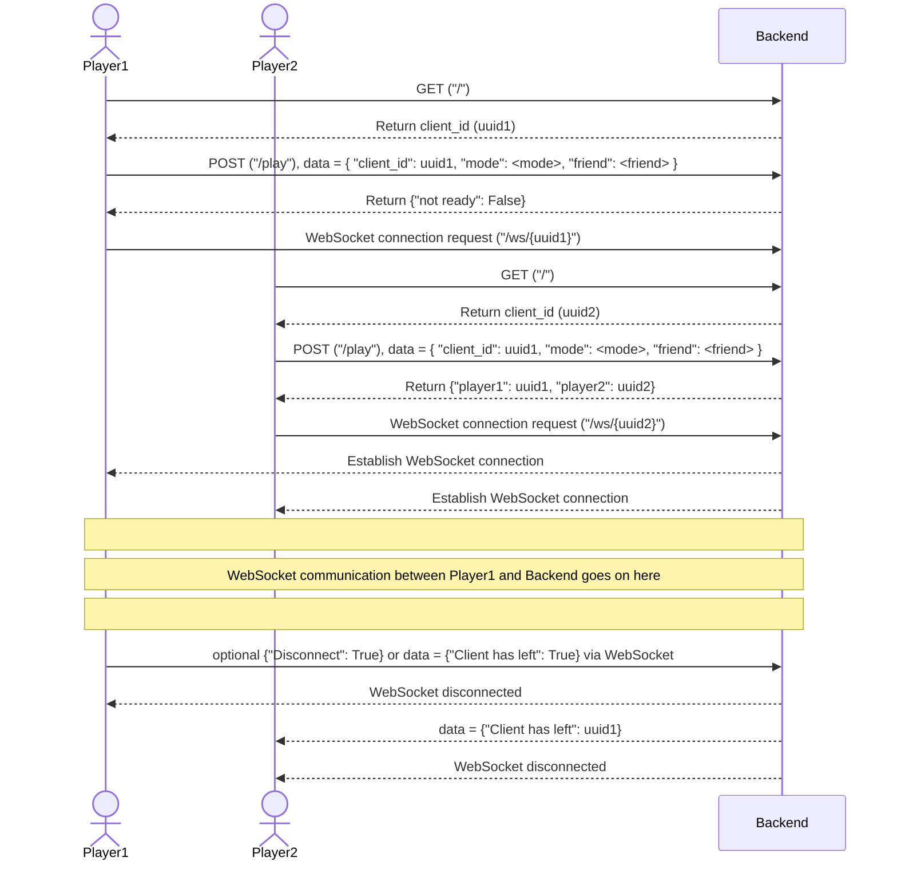

 # Communication before and after a game

```mermaid

sequenceDiagram
    actor Player1 as Player1
    actor Player2 as Player2
    participant Backend as Backend

    Player1->>Backend: GET ("/")
    Backend-->>Player1: Return client_id (uuid1)
    Player1->>Backend: POST ("/play"), data = { "client_id": uuid1, "mode": <mode>, "friend": <friend> }
    Backend-->>Player1: Return {"not ready": False}
    Player1->>Backend: WebSocket connection request ("/ws/{uuid1}")

    Player2->>Backend: GET ("/")
    Backend-->>Player2: Return client_id (uuid2)
    Player2->>Backend: POST ("/play"), data = { "client_id": uuid1, "mode": <mode>, "friend": <friend> }
    Backend-->>Player2: Return {"player1": uuid1, "player2": uuid2}

    Player2->>Backend: WebSocket connection request ("/ws/{uuid2}")
    Backend-->>Player1: Establish WebSocket connection
    Backend-->>Player2: Establish WebSocket connection

    Note over Player1,Backend: 
    Note over Player1,Backend: WebSocket communication between Player1 and Backend goes on here
    Note over Player1,Backend: 


    Player1->>Backend: optional {"Disconnect": True} or data = {"Client has left": True} via WebSocket
    Backend-->>Player1: WebSocket disconnected

    Backend-->>Player2: data = {"Client has left": uuid1}
    Backend-->>Player2: WebSocket disconnected

```