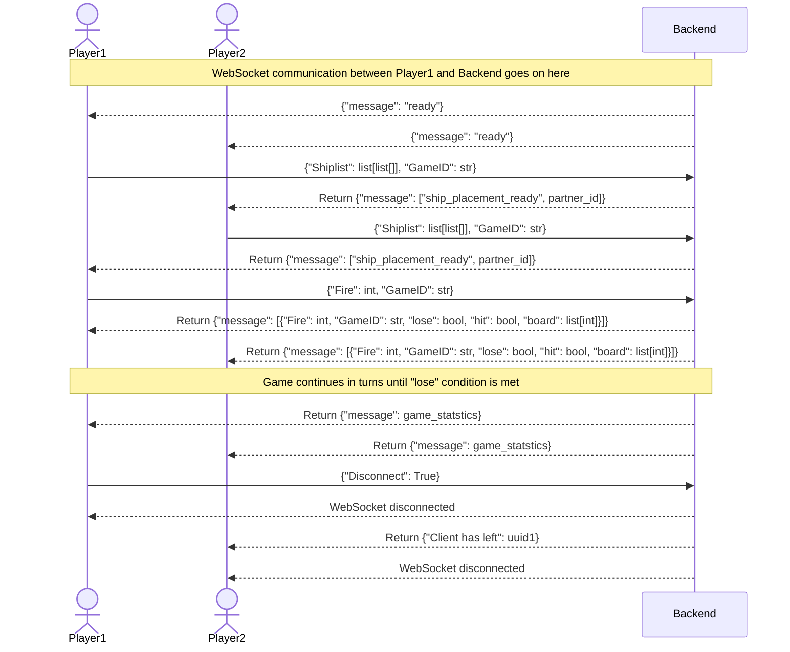

# Websocket data exchange

```mermaid

sequenceDiagram
    actor Player1 as Player1
    actor Player2 as Player2
    participant Backend as Backend

    Note over Player1,Backend: WebSocket communication between Player1 and Backend goes on here

    Backend-->>Player1: {"message": "ready"}
    Backend-->>Player2: {"message": "ready"}

    Player1->>Backend: {"Shiplist": list[list[]], "GameID": str}
    Backend-->>Player2: Return {"message": ["ship_placement_ready", partner_id]}
    Player2->>Backend: {"Shiplist": list[list[]], "GameID": str}
    Backend-->>Player1: Return {"message": ["ship_placement_ready", partner_id]}


    Player1->>Backend: {"Fire": int, "GameID": str}
    Backend-->>Player1: Return {"message": [{"Fire": int, "GameID": str, "lose": bool, "hit": bool, "board": list[int]}]}
    Backend-->>Player2: Return {"message": [{"Fire": int, "GameID": str, "lose": bool, "hit": bool, "board": list[int]}]}

    Note over Player1,Backend: Game continues in turns until "lose" condition is met

    Backend-->>Player1: Return {"message": game_statstics}
    Backend-->>Player2: Return {"message": game_statstics}

    Player1->>Backend: {"Disconnect": True}
    Backend-->>Player1: WebSocket disconnected

    Backend-->>Player2: Return {"Client has left": uuid1}
    Backend-->>Player2: WebSocket disconnected


```